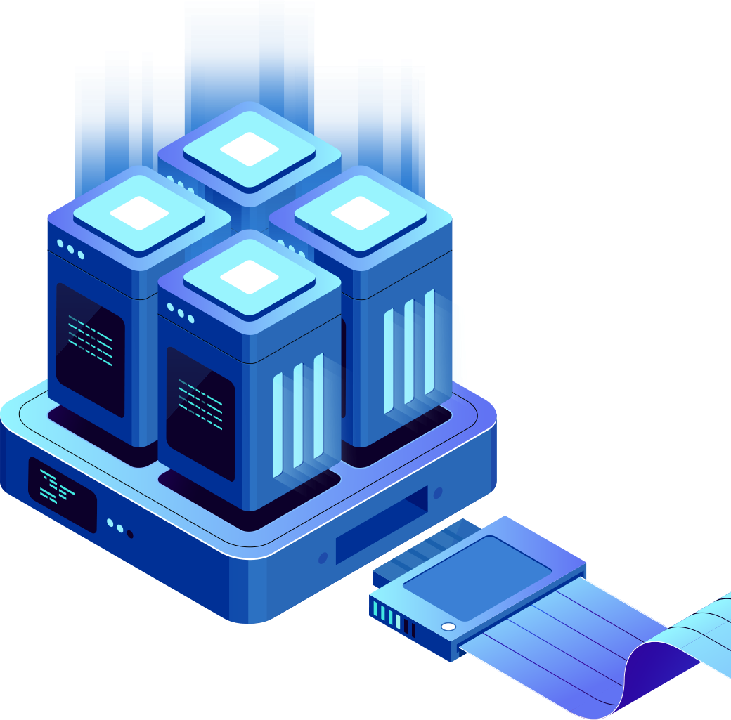

# Introduction

🔰 The **Zura Cloud** project envisions the cloud computing infrastructure to be an environment where the user’s data is hosted on a wide range of systems in an encrypted and anonymous manner. From home computers, mid-range servers, to data center level hardware could be utilized with **Zura Cloud**, fully trusting that the data is safe and private while in transit, and at rest.

🔰 **Zura Cloud** removes the middlemen consisting of cloud service provider companies and replaces them with a smart contract. The **Zura Cloud** nodes are meticulously programmed virtual machines that obey the smart contract. Users’ software and data run inside **Zura Cloud** nodes exactly according to the smart contract implementation. These nodes are location-agnostic, self-replicating and constantly spawning in random locations on the internet. This allows the user’s software and data to be online and run permanent.

🔰 The design of the smart contracts and the underlying infrastructure of **Zura Cloud** is backed by a team that cumulates many years of experience in cloud computing.

<figure><figcaption></figcaption></figure>
